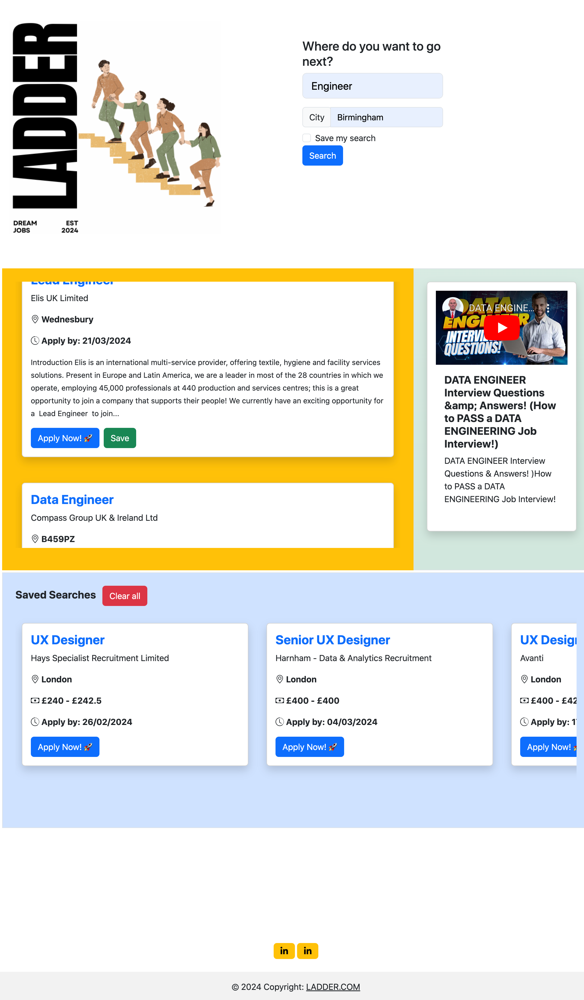

# Job-Search-Application

## Description
A Job Search app that returns a list of 10 relevant job listings and an accompanying video of interview questions for that job title, according to the users 'Job Title' and 'Location' input. The location field is optional. Users can save their search input, as well as individual job listing cards, which will populate when they next return to the website.

## Usage

The website can be publically accessed at https://timeades.github.io/Job-Search-Application/

CORS needs to be disabled for full app functionality. To disable CORS checks in Google Chrome, you need to close the browser and start it with the --disable-web-security and --user-data-dir flags. By doing that, Google Chrome will not send CORS preflight requests and will not validate CORS headers.

# Windows
chrome.exe --user-data-dir="C://chrome-dev-disabled-security" --disable-web-security --disable-site-isolation-trials

# macOS
open /Applications/Google\ Chrome.app --args --user-data-dir="/var/tmp/chrome-dev-disabled-security" --disable-web-security --disable-site-isolation-trials

# Linux
google-chrome --user-data-dir="~/chrome-dev-disabled-security" --disable-web-security --disable-site-isolation-trials

## Credits
This project makes use of the [YouTube Data API by Google](https://developers.google.com/youtube/v3) and the [Reed Job Seekers API](https://www.reed.co.uk/developers/jobseeker). 

This project relies extensively on [Bootstrap](https://getbootstrap.com/) and [jQueary](https://jquery.com/) libraries and usage documentation.

We used [Canva](https://www.canva.com/en_gb/) to create our graphics, and sourced icons from [Font Awesome](https://fontawesome.com/).

This project would not have been possible without moral and technical support from Kayvon Kazemini, Teaching Assistant on the EdX Skills for Life program.

## License
BSD License(4-clause)
Copyright (c) <2024>, <Esther Babirye, Catherine Beagent, Tim Eades>
All rights reserved.

Redistribution and use in source and binary forms, with or without
modification, are permitted provided that the following conditions are met:
1. Redistributions of source code must retain the above copyright
   notice, this list of conditions and the following disclaimer.
2. Redistributions in binary form must reproduce the above copyright
   notice, this list of conditions and the following disclaimer in the
   documentation and/or other materials provided with the distribution.
3. All advertising materials mentioning features or use of this software
   must display the following acknowledgement:
   This product includes software developed by the <organization>.
4. Neither the name of the <organization> nor the
   names of its contributors may be used to endorse or promote products
   derived from this software without specific prior written permission.

THIS SOFTWARE IS PROVIDED BY THE COPYRIGHT HOLDER ''AS IS'' AND ANY
EXPRESS OR IMPLIED WARRANTIES, INCLUDING, BUT NOT LIMITED TO, THE IMPLIED
WARRANTIES OF MERCHANTABILITY AND FITNESS FOR A PARTICULAR PURPOSE ARE
DISCLAIMED. IN NO EVENT SHALL THE COPYRIGHT HOLDER OR CONTRIBUTORS BE LIABLE
FOR ANY DIRECT, INDIRECT, INCIDENTAL, SPECIAL, EXEMPLARY, OR CONSEQUENTIAL 
DAMAGES (INCLUDING, BUT NOT LIMITED TO, PROCUREMENT OF SUBSTITUTE GOODS OR 
SERVICES; LOSS OF USE, DATA, OR PROFITS; OR BUSINESS INTERRUPTION) HOWEVER 
CAUSED AND ON ANY THEORY OF LIABILITY, WHETHER IN CONTRACT, STRICT LIABILITY,
OR TORT (INCLUDING NEGLIGENCE OR OTHERWISE) ARISING IN ANY WAY OUT OF THE 
USE OF THIS SOFTWARE, EVEN IF ADVISED OF THE POSSIBILITY OF SUCH DAMAGE.
